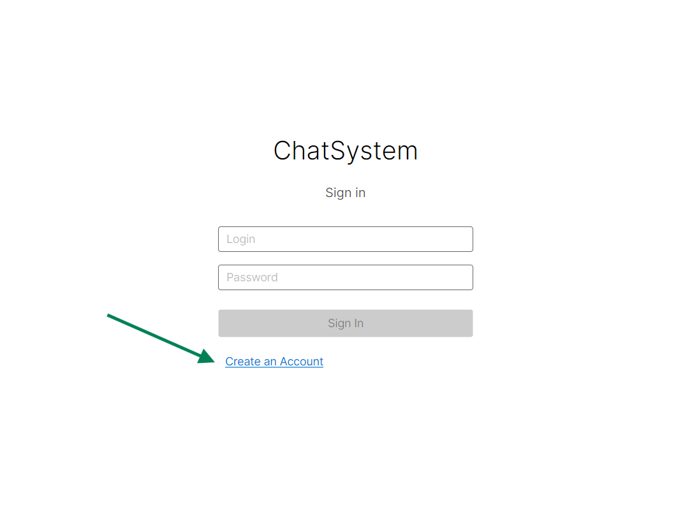
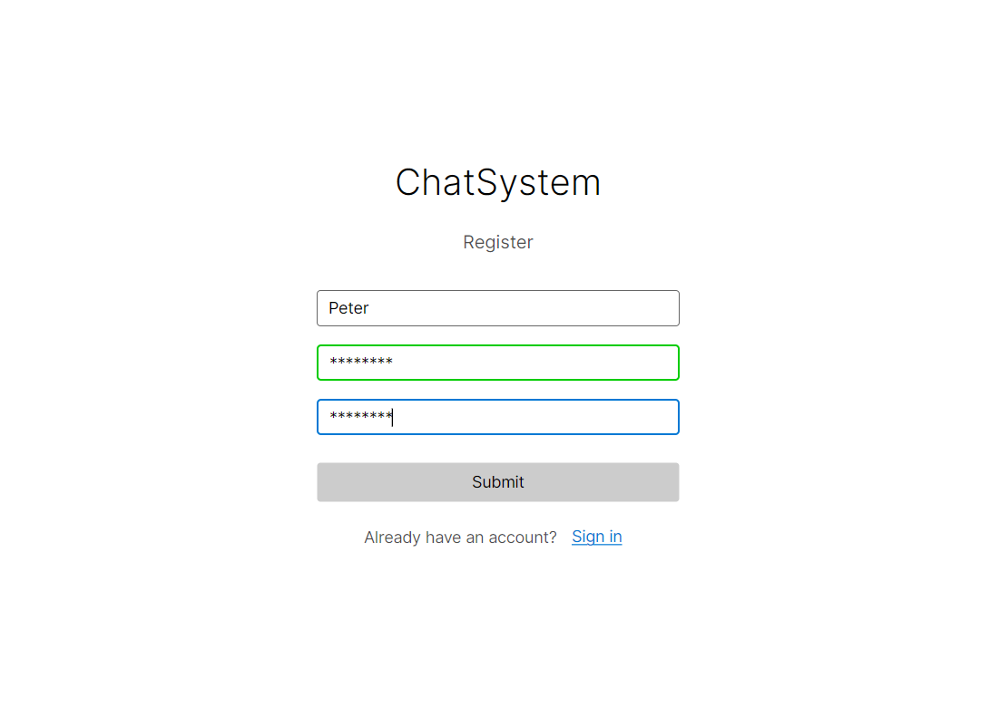
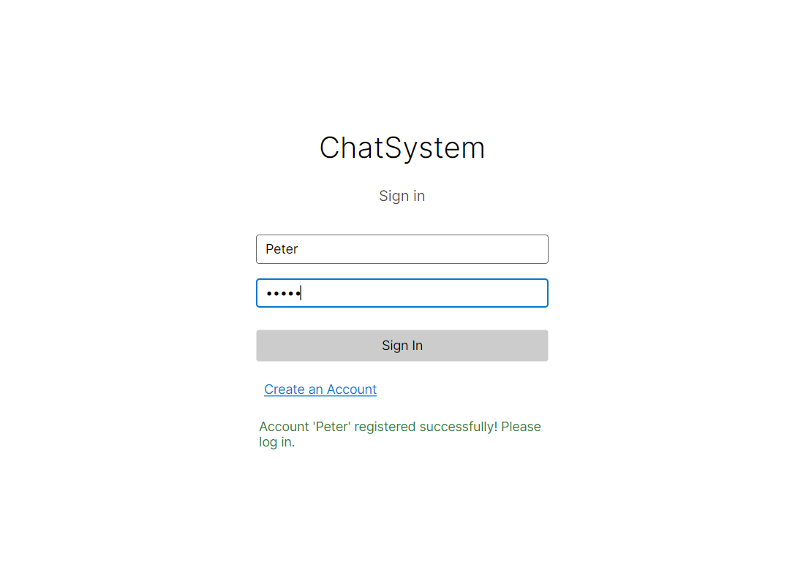
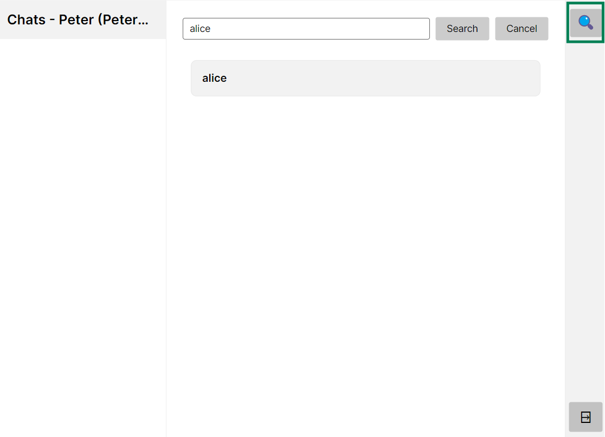
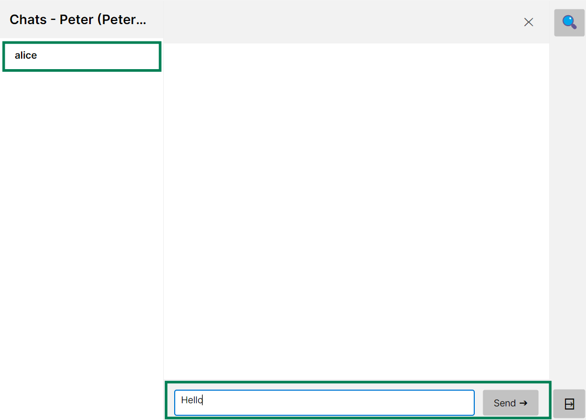
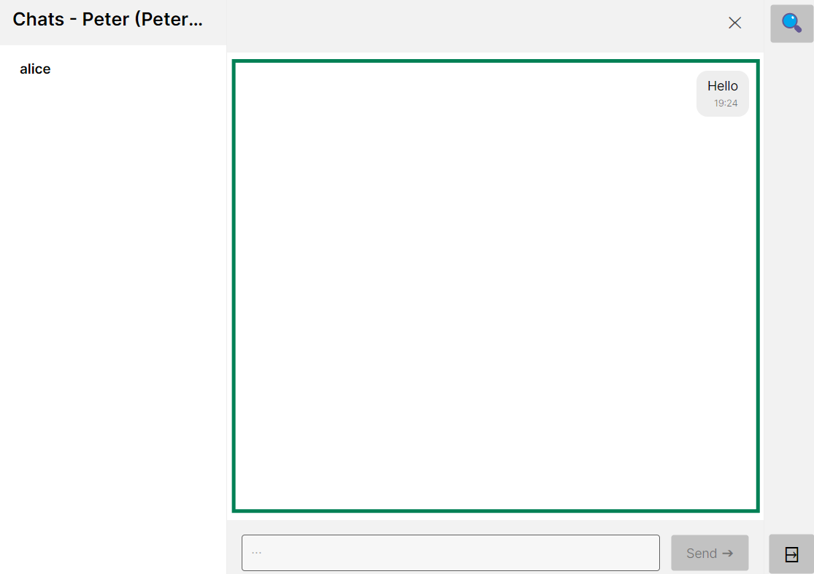
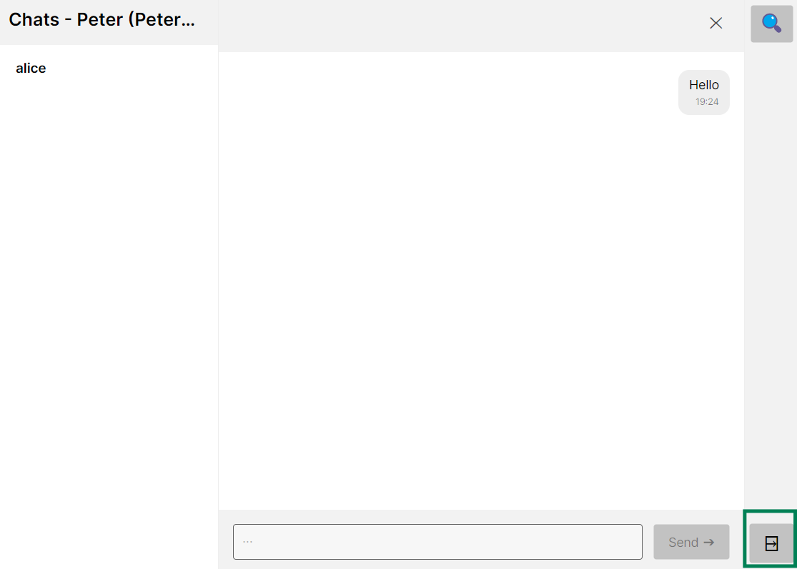

# ChatSystem Client

### Overview

Frontend for a chatting application with end-to-end encryption (E2EE).

Performs local caching of recent/frequently-used data such as encryption keys or newest messages and
communicates with a server using REST API.

**Full specification:**
[Specification](./spec/README.md)

## Prerequisites

### Hardware

#### Windows

- 1 GHz processor
- 4 GB of RAM
- 64 GB of hard disk space

#### Linux (Ubuntu/Debian)

- 1 GHz processor
- 3 GB of RAM
- 25 GB of hard disk space

### Software

 - .NET 9.0 Runtime

## Quick guide on how to build and run the application

**Clone the repository, enter the application directory**

```bash
git clone <repository-url>
cd src/ChatSystem.Client
```

**Build and run**

```bash
dotnet run -c Release
```

## Testing

Run from directory root:

```bash
dotnet test
```

## Using the application

### 1. Create an account



### 2. Type your credentials



### 3. Sign in



### 4. Search for other users



### 5. Enter the conversation

After selecting one of the search results, the selected user gets added to the chat list within a left sidebar.



### 6. Chat

Type your message and send. The whole conversation stream is visible in the dedicated detail pane.



### 7. Logout

